# Emoji

A Kotlin Multiplatform library to add Emoji support to your Android App / JVM Backend.

- JVM
  - Check out the sample jvm module for text parsing / searching functionality
- Android
  - Picking
    - [`EmojiPopup`](emoji/src/androidMain/kotlin/com/vanniktech/emoji/EmojiPopup.kt) - [PopupWindow](https://developer.android.com/reference/android/widget/PopupWindow) which overalys over the soft keyboard
    - [`EmojiView`](emoji/src/androidMain/kotlin/com/vanniktech/emoji/EmojiView.kt) - Normal view which is used by `EmojiPopup` and can also be used as a standalone to select emojis via categories
  - Displaying (Android)
    - [`EmojiAutoCompleteTextView`](emoji/src/main/java/com/vanniktech/emoji/EmojiAutoCompleteTextView.kt)
    - [`EmojiButton`](emoji/src/main/java/com/vanniktech/emoji/EmojiButton.kt)
    - [`EmojiCheckbox`](emoji/src/main/java/com/vanniktech/emoji/EmojiCheckbox.kt)
    - [`EmojiEditText`](emoji/src/main/java/com/vanniktech/emoji/EmojiEditText.kt)
    - [`EmojiMultiAutoCompleteTextView`](emoji/src/main/java/com/vanniktech/emoji/EmojiMultiAutoCompleteTextView.kt)
    - [`EmojiTextView`](emoji/src/main/java/com/vanniktech/emoji/EmojiTextView.kt)
    - For convenience, there's also a [`EmojiLayoutFactory`](emoji/src/main/java/com/vanniktech/emoji/EmojiLayoutFactory.kt), which can be used to get automatic Emoji support when using normal Android Views such as `TextView`, `Checkbox`, etc.

The library has 4 different sprites providers to choose from ([iOS](#ios-emojis), [Google](#google), [Facebook](#facebook) & [Twitter](#twitter)). The emoji's are packaged as pictures and loaded at runtime. If you want to use a Font provider, check out [Google Compat](#google-compat).

## iOS Emojis

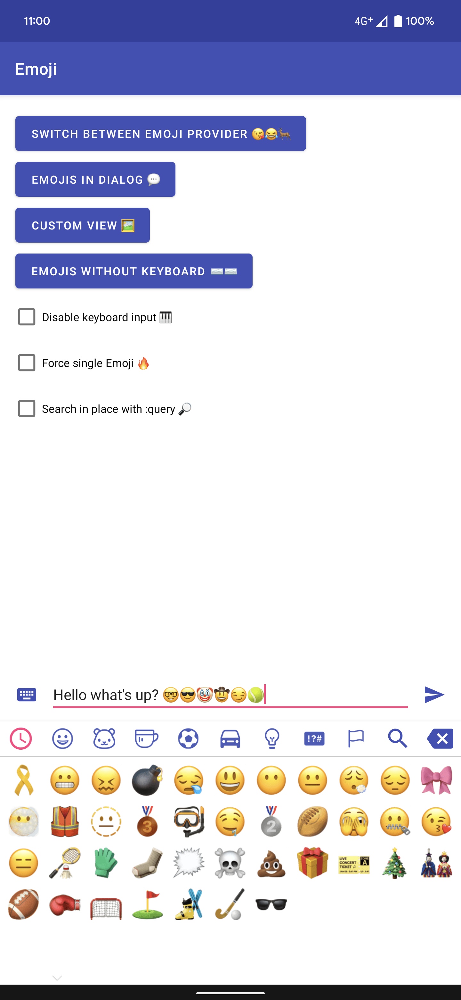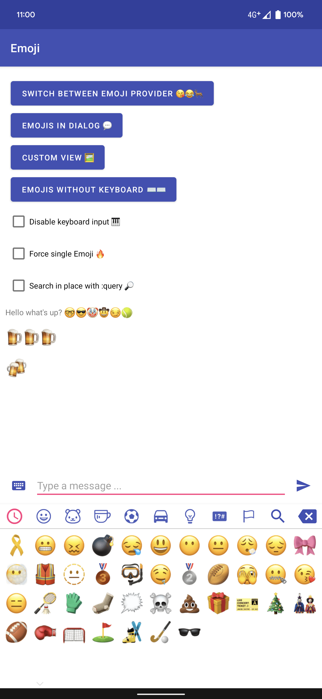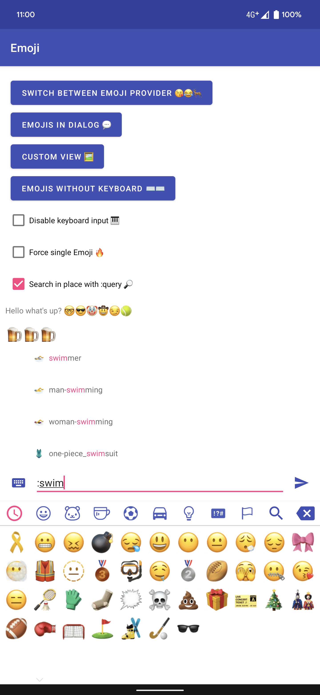

For getting the above iOS Emojis, add the dependency:

```groovy
implementation "com.vanniktech:emoji-ios:0.15.0"
```

And install the provider in your Application class.

```kotlin
import com.vanniktech.emoji.EmojiManager
import com.vanniktech.emoji.ios.IosEmojiProvider

EmojiManager.install(IosEmojiProvider())
```

## Google

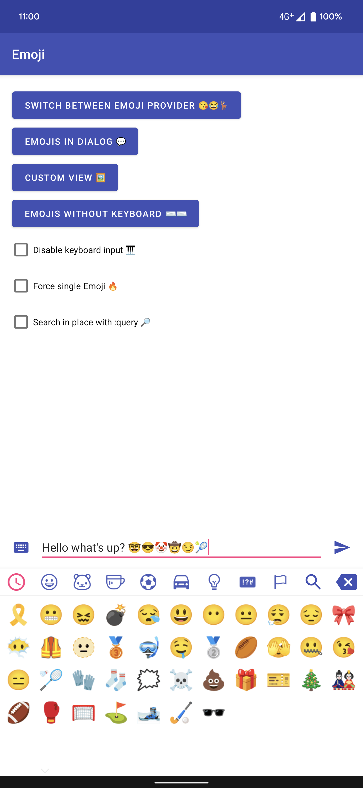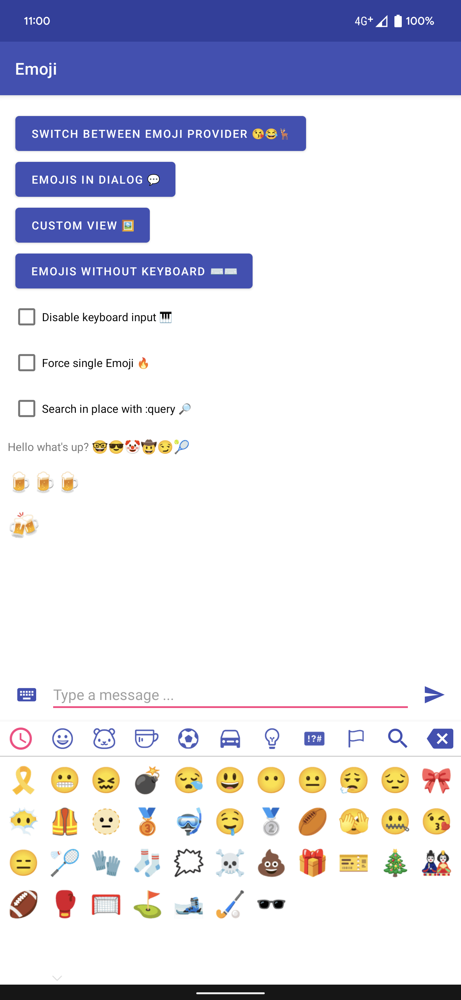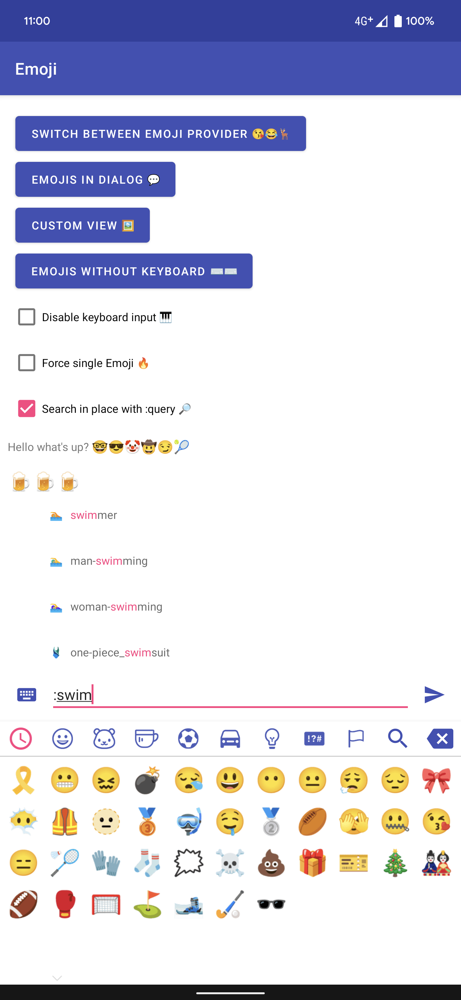

For getting the above Google Emojis, add the dependency:

```groovy
implementation "com.vanniktech:emoji-google:0.15.0"
```

And install the provider in your Application class.

```kotlin
import com.vanniktech.emoji.EmojiManager
import com.vanniktech.emoji.google.GoogleEmojiProvider

EmojiManager.install(GoogleEmojiProvider())
```

## Facebook


For getting the above Facebook Emojis, add the dependency:

```groovy
implementation "com.vanniktech:emoji-facebook:0.15.0"
```

And install the provider in your Application class.

```kotlin
import com.vanniktech.emoji.EmojiManager
import com.vanniktech.emoji.facebook.FacebookEmojiProvider

EmojiManager.install(FacebookEmojiProvider())
```

## Twitter

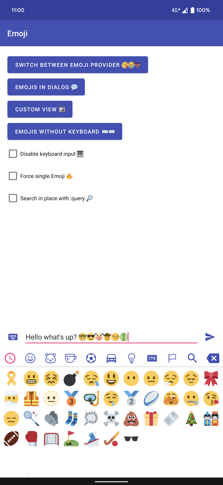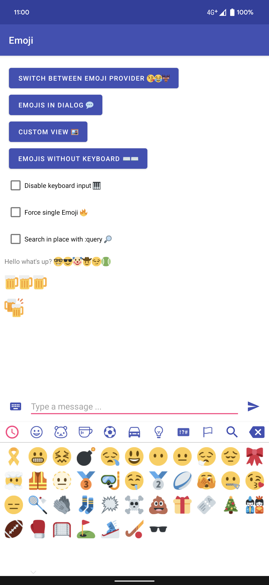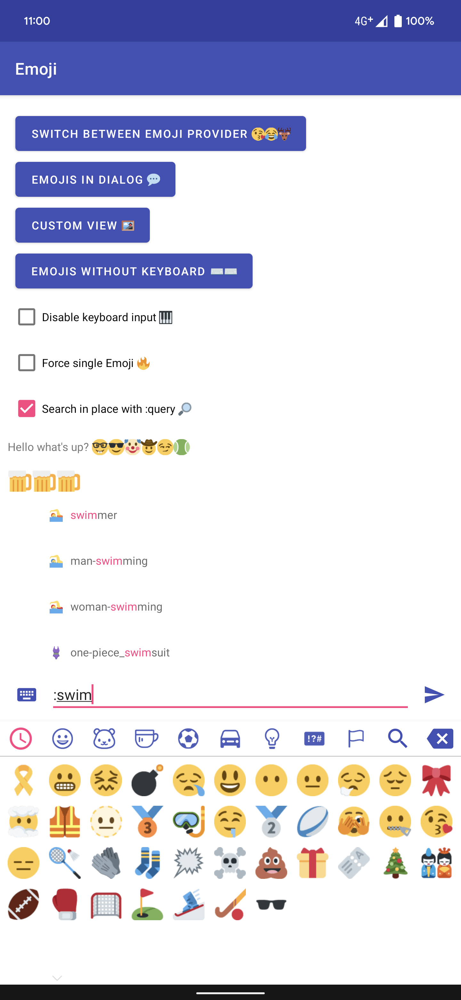

For getting the above Twitter Emojis, add the dependency:

```groovy
implementation "com.vanniktech:emoji-twitter:0.15.0"
```

And install the provider in your Application class.

```kotlin
import com.vanniktech.emoji.EmojiManager
import com.vanniktech.emoji.twitter.TwitterEmojiProvider

EmojiManager.install(TwitterEmojiProvider())
```

## Google Compat

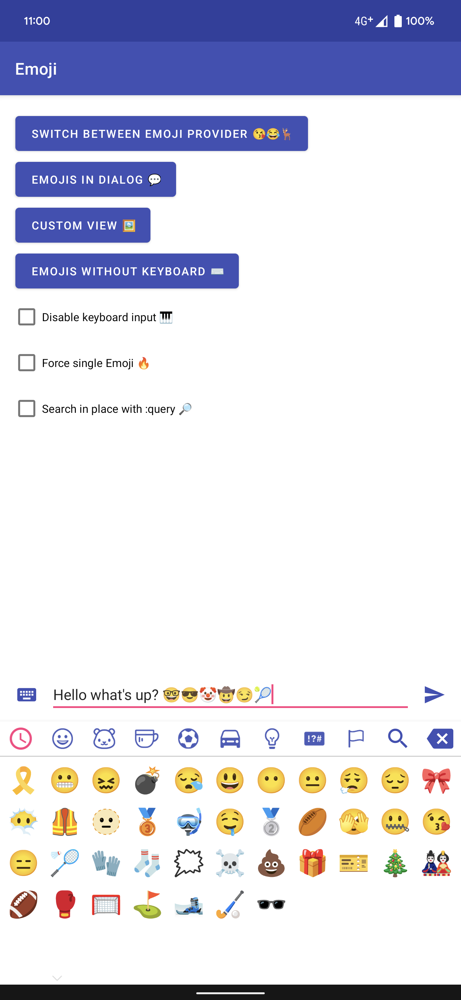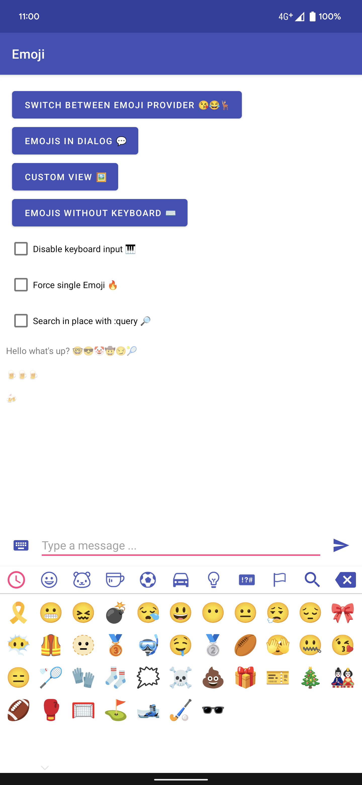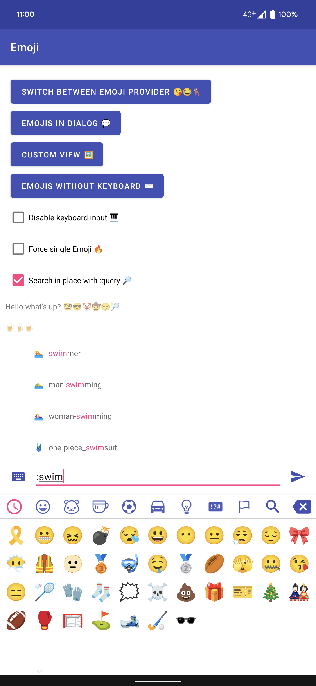

For getting the above Google Emojis, add the dependency (only works for Android Apps):

```groovy
implementation "com.vanniktech:emoji-google-compat:0.15.0"
```

And install the provider in your Application class.

```kotlin
import androidx.core.provider.FontRequest
import androidx.emoji.text.EmojiCompat
import androidx.emoji.text.FontRequestEmojiCompatConfig
import com.vanniktech.emoji.EmojiManager
import com.vanniktech.emoji.googlecompat.GoogleCompatEmojiProvider

EmojiManager.install(GoogleCompatEmojiProvider(EmojiCompat.init(
    FontRequestEmojiCompatConfig(
      this,
      FontRequest(
        "com.google.android.gms.fonts",
        "com.google.android.gms",
        "Noto Color Emoji Compat",
        R.array.com_google_android_gms_fonts_certs,
      )
    ).setReplaceAll(true)
  )
))
```

Instead of using pictures, the Emojis are loaded via a Font which is downloaded at runtime, hence the library size is much much smaller in comparison. To load the font, please declare the following array:

```xml
<array name="com_google_android_gms_fonts_certs">
  <item>@array/com_google_android_gms_fonts_certs_dev</item>
  <item>@array/com_google_android_gms_fonts_certs_prod</item>
</array>
<string-array name="com_google_android_gms_fonts_certs_dev" tools:ignore="Typos">
  <item>MIIEqDCCA5CgAwIBAgIJANWFuGx90071MA0GCSqGSIb3DQEBBAUAMIGUMQswCQYDVQQGEwJVUzETMBEGA1UECBMKQ2FsaWZvcm5pYTEWMBQGA1UEBxMNTW91bnRhaW4gVmlldzEQMA4GA1UEChMHQW5kcm9pZDEQMA4GA1UECxMHQW5kcm9pZDEQMA4GA1UEAxMHQW5kcm9pZDEiMCAGCSqGSIb3DQEJARYTYW5kcm9pZEBhbmRyb2lkLmNvbTAeFw0wODA0MTUyMzM2NTZaFw0zNTA5MDEyMzM2NTZaMIGUMQswCQYDVQQGEwJVUzETMBEGA1UECBMKQ2FsaWZvcm5pYTEWMBQGA1UEBxMNTW91bnRhaW4gVmlldzEQMA4GA1UEChMHQW5kcm9pZDEQMA4GA1UECxMHQW5kcm9pZDEQMA4GA1UEAxMHQW5kcm9pZDEiMCAGCSqGSIb3DQEJARYTYW5kcm9pZEBhbmRyb2lkLmNvbTCCASAwDQYJKoZIhvcNAQEBBQADggENADCCAQgCggEBANbOLggKv+IxTdGNs8/TGFy0PTP6DHThvbbR24kT9ixcOd9W+EaBPWW+wPPKQmsHxajtWjmQwWfna8mZuSeJS48LIgAZlKkpFeVyxW0qMBujb8X8ETrWy550NaFtI6t9+u7hZeTfHwqNvacKhp1RbE6dBRGWynwMVX8XW8N1+UjFaq6GCJukT4qmpN2afb8sCjUigq0GuMwYXrFVee74bQgLHWGJwPmvmLHC69EH6kWr22ijx4OKXlSIx2xT1AsSHee70w5iDBiK4aph27yH3TxkXy9V89TDdexAcKk/cVHYNnDBapcavl7y0RiQ4biu8ymM8Ga/nmzhRKya6G0cGw8CAQOjgfwwgfkwHQYDVR0OBBYEFI0cxb6VTEM8YYY6FbBMvAPyT+CyMIHJBgNVHSMEgcEwgb6AFI0cxb6VTEM8YYY6FbBMvAPyT+CyoYGapIGXMIGUMQswCQYDVQQGEwJVUzETMBEGA1UECBMKQ2FsaWZvcm5pYTEWMBQGA1UEBxMNTW91bnRhaW4gVmlldzEQMA4GA1UEChMHQW5kcm9pZDEQMA4GA1UECxMHQW5kcm9pZDEQMA4GA1UEAxMHQW5kcm9pZDEiMCAGCSqGSIb3DQEJARYTYW5kcm9pZEBhbmRyb2lkLmNvbYIJANWFuGx90071MAwGA1UdEwQFMAMBAf8wDQYJKoZIhvcNAQEEBQADggEBABnTDPEF+3iSP0wNfdIjIz1AlnrPzgAIHVvXxunW7SBrDhEglQZBbKJEk5kT0mtKoOD1JMrSu1xuTKEBahWRbqHsXclaXjoBADb0kkjVEJu/Lh5hgYZnOjvlba8Ld7HCKePCVePoTJBdI4fvugnL8TsgK05aIskyY0hKI9L8KfqfGTl1lzOv2KoWD0KWwtAWPoGChZxmQ+nBli+gwYMzM1vAkP+aayLe0a1EQimlOalO762r0GXO0ks+UeXde2Z4e+8S/pf7pITEI/tP+MxJTALw9QUWEv9lKTk+jkbqxbsh8nfBUapfKqYn0eidpwq2AzVp3juYl7//fKnaPhJD9gs=</item>
</string-array>
<string-array name="com_google_android_gms_fonts_certs_prod" tools:ignore="Typos">
  <item>MIIEQzCCAyugAwIBAgIJAMLgh0ZkSjCNMA0GCSqGSIb3DQEBBAUAMHQxCzAJBgNVBAYTAlVTMRMwEQYDVQQIEwpDYWxpZm9ybmlhMRYwFAYDVQQHEw1Nb3VudGFpbiBWaWV3MRQwEgYDVQQKEwtHb29nbGUgSW5jLjEQMA4GA1UECxMHQW5kcm9pZDEQMA4GA1UEAxMHQW5kcm9pZDAeFw0wODA4MjEyMzEzMzRaFw0zNjAxMDcyMzEzMzRaMHQxCzAJBgNVBAYTAlVTMRMwEQYDVQQIEwpDYWxpZm9ybmlhMRYwFAYDVQQHEw1Nb3VudGFpbiBWaWV3MRQwEgYDVQQKEwtHb29nbGUgSW5jLjEQMA4GA1UECxMHQW5kcm9pZDEQMA4GA1UEAxMHQW5kcm9pZDCCASAwDQYJKoZIhvcNAQEBBQADggENADCCAQgCggEBAKtWLgDYO6IIrgqWbxJOKdoR8qtW0I9Y4sypEwPpt1TTcvZApxsdyxMJZ2JORland2qSGT2y5b+3JKkedxiLDmpHpDsz2WCbdxgxRczfey5YZnTJ4VZbH0xqWVW/8lGmPav5xVwnIiJS6HXk+BVKZF+JcWjAsb/GEuq/eFdpuzSqeYTcfi6idkyugwfYwXFU1+5fZKUaRKYCwkkFQVfcAs1fXA5V+++FGfvjJ/CxURaSxaBvGdGDhfXE28LWuT9ozCl5xw4Yq5OGazvV24mZVSoOO0yZ31j7kYvtwYK6NeADwbSxDdJEqO4k//0zOHKrUiGYXtqw/A0LFFtqoZKFjnkCAQOjgdkwgdYwHQYDVR0OBBYEFMd9jMIhF1Ylmn/Tgt9r45jk14alMIGmBgNVHSMEgZ4wgZuAFMd9jMIhF1Ylmn/Tgt9r45jk14aloXikdjB0MQswCQYDVQQGEwJVUzETMBEGA1UECBMKQ2FsaWZvcm5pYTEWMBQGA1UEBxMNTW91bnRhaW4gVmlldzEUMBIGA1UEChMLR29vZ2xlIEluYy4xEDAOBgNVBAsTB0FuZHJvaWQxEDAOBgNVBAMTB0FuZHJvaWSCCQDC4IdGZEowjTAMBgNVHRMEBTADAQH/MA0GCSqGSIb3DQEBBAUAA4IBAQBt0lLO74UwLDYKqs6Tm8/yzKkEu116FmH4rkaymUIE0P9KaMftGlMexFlaYjzmB2OxZyl6euNXEsQH8gjwyxCUKRJNexBiGcCEyj6z+a1fuHHvkiaai+KL8W1EyNmgjmyy8AW7P+LLlkR+ho5zEHatRbM/YAnqGcFh5iZBqpknHf1SKMXFh4dd239FJ1jWYfbMDMy3NS5CTMQ2XFI1MvcyUTdZPErjQfTbQe3aDQsQcafEQPD+nqActifKZ0Np0IS9L9kR/wbNvyz6ENwPiTrjV2KRkEjH78ZMcUQXg0L3BYHJ3lc69Vs5Ddf9uUGGMYldX3WfMBEmh/9iFBDAaTCK</item>
</string-array>
```

## Custom Emojis

If you want to display your own Emojis you can create your own implementation of [`EmojiProvider`](emoji/src/main/java/com/vanniktech/emoji/EmojiProvider.kt) and pass it to `EmojiManager.install`.

All of the core API lays in `emoji`, which is being pulled in automatically by the providers:

```groovy
implementation "com.vanniktech:emoji:0.15.0"
```

## Android Material

Material Design Library bindings can be included via:

```groovy
implementation "com.vanniktech:emoji-material:0.15.0"
```

- [`EmojiMaterialButton`](emoji-material/src/main/java/com/vanniktech/emoji/material/EmojiMaterialButton.kt)
- [`EmojiMaterialRadioButton`](emoji-material/src/main/java/com/vanniktech/emoji/material/EmojiMaterialRadioButton.kt)
- [`MaterialCheckBox`](emoji-material/src/main/java/com/vanniktech/emoji/material/MaterialCheckBox.kt)
- [`EmojiTextInputEditText`](./emoji-material/src/main/java/com/vanniktech/emoji/material/EmojiTextInputEditText.kt)

For convenience, there's also a [`MaterialEmojiLayoutFactory`](emoji-material/src/main/java/com/vanniktech/emoji/material/MaterialEmojiLayoutFactory.kt), which can be used to get automatic Emoji support.

## Set up Android

### Inserting Emojis

Declare your [`EmojiEditText`](emoji/src/main/java/com/vanniktech/emoji/EmojiEditText.kt) in your layout xml file.

```xml
<com.vanniktech.emoji.EmojiEditText
  android:id="@+id/emojiEditText"
  android:layout_width="match_parent"
  android:layout_height="wrap_content"
  android:imeOptions="actionSend"
  android:inputType="textCapSentences|textMultiLine"
  android:maxLines="3"/>
```

To open the [`EmojiPopup`](emoji/src/main/java/com/vanniktech/emoji/EmojiPopup.kt) execute the code below:

```kotlin
val emojiPopup = EmojiPopup(rootView, emojiEditText)
emojiPopup.toggle() // Toggles visibility of the Popup.
emojiPopup.dismiss() // Dismisses the Popup.
emojiPopup.isShowing() // Returns true when Popup is showing.
```

The `rootView` is the rootView of your layout xml file which will be used for calculating the height of the keyboard.
`emojiEditText` is the [`EmojiEditText`](emoji/src/main/java/com/vanniktech/emoji/EmojiEditText.kt) that you declared in your layout xml file.

### Displaying Emojis

```xml
<com.vanniktech.emoji.EmojiTextView
  android:id="@+id/emojiTextView"
  android:layout_width="wrap_content"
  android:layout_height="wrap_content"/>
```

Just use the [`EmojiTextView`](emoji/src/main/java/com/vanniktech/emoji/EmojiTextView.kt) and call `setText` with the String that contains Unicode encoded Emojis. To change the size of the displayed Emojis call one of the `setEmojiSize` methods.

### EmojiPopup Listeners

The [`EmojiPopup`](emoji/src/main/java/com/vanniktech/emoji/EmojiPopup.kt) class allows you to declare several listeners.

```kotlin
EmojiPopup(
  onSoftKeyboardCloseListener = { },
  onEmojiClickListener = { },
  onSoftKeyboardOpenListener = { },
  onEmojiPopupShownListener = { },
  onEmojiPopupDismissListener = { },
  onEmojiBackspaceClickListener = { },
)
```

### EmojiPopup Configuration

#### Custom Recent Emoji implementation

You can pass your own implementation of the recent Emojis. Implement the [`RecentEmoji`](emoji/src/main/java/com/vanniktech/emoji/RecentEmoji.kt) interface and pass it when you're building the [`EmojiPopup`](emoji/src/main/java/com/vanniktech/emoji/EmojiPopup.kt):

```kotlin
EmojiPopup(
  recentEmoji = yourClassThatImplementsRecentEmoji,
)
```

If no instance or a null instance is set the [default implementation](emoji/src/main/java/com/vanniktech/emoji/RecentEmojiManager.kt) will be used.

#### Custom Variant Emoji implementation

You can pass your own implementation of the variant Emojis. Implement the [`VariantEmoji`](emoji/src/main/java/com/vanniktech/emoji/VariantEmoji.kt) interface and pass it when you're building the [`EmojiPopup`](emoji/src/main/java/com/vanniktech/emoji/EmojiPopup.kt):

```kotlin
EmojiPopup(
  variantEmoji = yourClassThatImplementsVariantEmoji,
)
```

If no instance or a null instance is set the [default implementation](emoji/src/main/java/com/vanniktech/emoji/VariantEmojiManager.kt) will be used.

#### Custom Search Emoji implementation

You can pass your own implementation for searching Emojis. Implement the [`SearchEmoji`](emoji/src/main/java/com/vanniktech/emoji/SearchEmoji.kt) interface and pass it when you're building the [`EmojiPopup`](emoji/src/main/java/com/vanniktech/emoji/EmojiPopup.kt):

```kotlin
EmojiPopup(
  searchEmoji = yourClassThatImplementsSearchEmoji,
)
```

If no instance or a null instance is set the [default implementation](emoji/src/main/java/com/vanniktech/emoji/SearchEmojiManager.kt) will be used.

### Animations

#### Custom keyboard enter and exit animations

You can pass your own animation style for enter and exit transitions of the Emoji keyboard while you're building the [`EmojiPopup`](emoji/src/main/java/com/vanniktech/emoji/EmojiPopup.kt):

```kotlin
EmojiPopup(
  keyboardAnimationStyle = emoji_fade_animation_style,
)
```

If no style is set the keyboard will appear and exit as a regular PopupWindow.
This library currently ships with two animation styles as an example:

- R.style.emoji_slide_animation_style
- R.style.emoji_fade_animation_style

#### Custom page transformers

You can pass your own Page Transformer for the Emoji keyboard View Pager while you're building the [`EmojiPopup`](emoji/src/main/java/com/vanniktech/emoji/EmojiPopup.kt):

```kotlin
EmojiPopup(
  pageTransformer = MagicTransformer(),
)
```

If no transformer is set ViewPager will behave as its usual self. Please do note that this library currently does not ship any example Page Transformers.

### Other goodies

- [`MaximalNumberOfEmojisInputFilter`](./emoji/src/main/kotlin/com/vanniktech/emoji/inputfilters/MaximalNumberOfEmojisInputFilter.kt) can be used to limit the number of Emojis one can type into an EditText
- [`OnlyEmojisInputFilter`](./emoji/src/main/kotlin/com/vanniktech/emoji/inputfilters/OnlyEmojisInputFilter.kt) can be used to limit the input of an EditText to emoji only
- [`ForceSingleEmojiTrait`](./emoji/src/main/kotlin/com/vanniktech/emoji/traits/ForceSingleEmojiTrait.kt) can be used to force a single emoji which can be replaced by a new one
- [`DisableKeyboardInputTrait`](./emoji/src/main/kotlin/com/vanniktech/emoji/traits/DisableKeyboardInputTrait.kt) disable input of the normal soft keyboard
- [`SearchInPlaceTrait`](./emoji/src/main/kotlin/com/vanniktech/emoji/traits/SearchInPlaceTrait.kt) search for an emoji using :query
- [`EmojiView`](emoji/src/main/java/com/vanniktech/emoji/EmojiView.kt) View of all emojis and categories which does not depend on a keyboard
- `EmojiEditText#disableKeyboardInput()` to disable normal keyboard input. To undo call `#enableKeyboardInput()`

Most of them are also showcased in the sample app.

## Set up JVM

Install one of the providers you want, for instance the iOS Provider:

```kotlin
import com.vanniktech.emoji.EmojiManager
import com.vanniktech.emoji.ios.IosEmojiProvider

EmojiManager.install(IosEmojiProvider())
```

Now you can use all the API's you want, for instance when you want to search for `swim` emojis, you can do:

```kotlin
import com.vanniktech.emoji.search.SearchEmojiManager

SearchEmojiManager().search(query = "swim")
  .forEach {
    println(it)
  }
```

# Snapshots

This library is also distributed as a SNAPSHOT, if you like to check out the latest features:
Add this to your repositories:

```groovy
maven { url "https://oss.sonatype.org/content/repositories/snapshots" }
```

```groovy
implementation "com.vanniktech:emoji:0.15.0-SNAPSHOT"
implementation "com.vanniktech:emoji-ios:0.15.0-SNAPSHOT"
implementation "com.vanniktech:emoji-google:0.15.0-SNAPSHOT"
implementation "com.vanniktech:emoji-google-compat:0.15.0-SNAPSHOT"
implementation "com.vanniktech:emoji-twitter:0.15.0-SNAPSHOT"
implementation "com.vanniktech:emoji-facebook:0.15.0-SNAPSHOT"
implementation "com.vanniktech:emoji-material:0.15.0-SNAPSHOT"
```

# Proguard / R8

No configuration needed.

# License

Copyright (C) 2016 - Niklas Baudy, Ruben Gees, Mario Đanić and contributors

Licensed under the Apache License, Version 2.0
